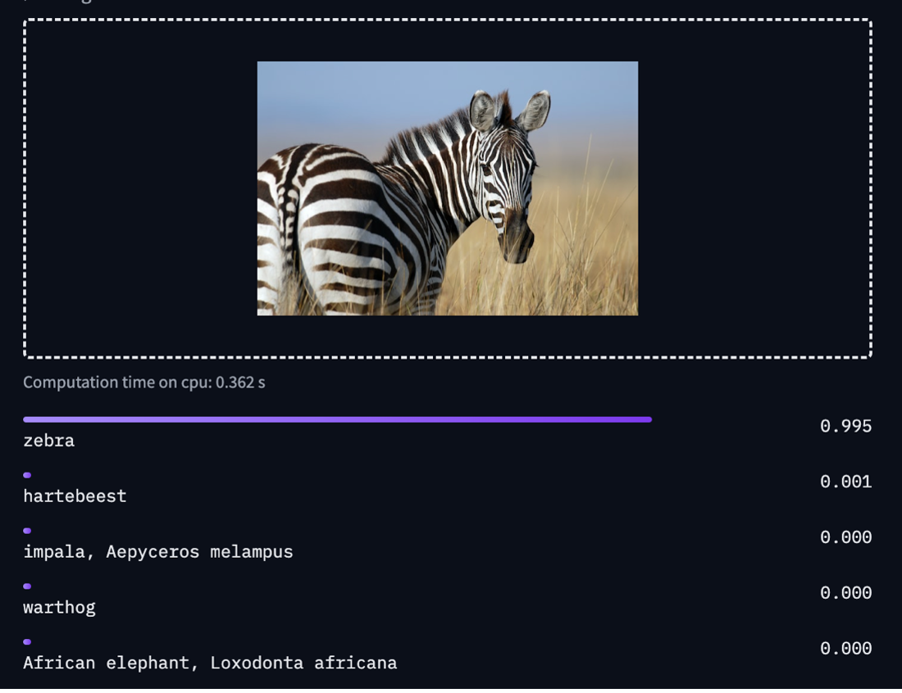
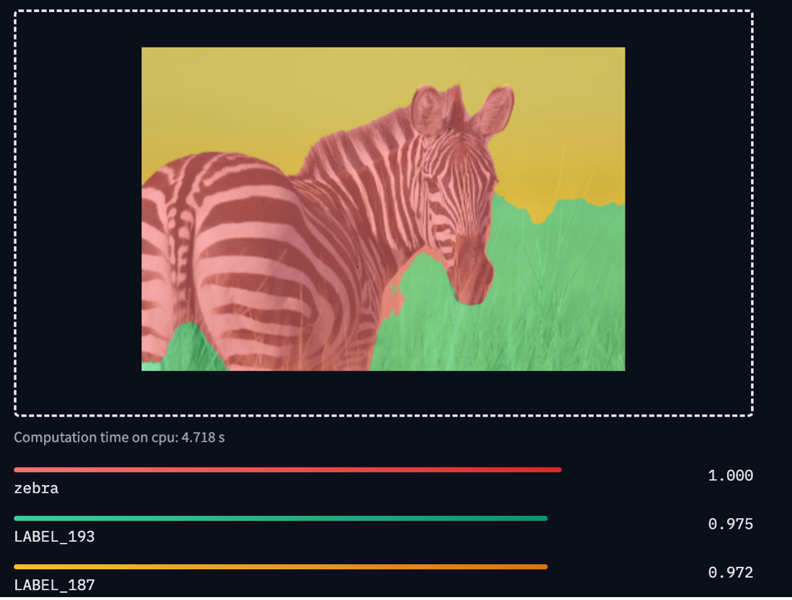
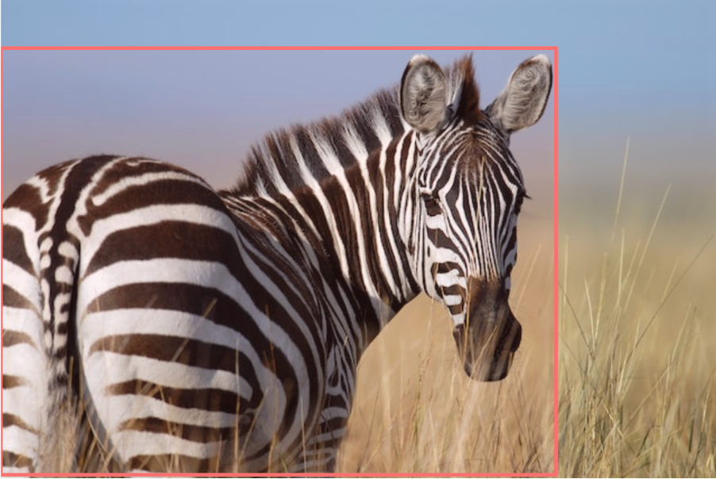
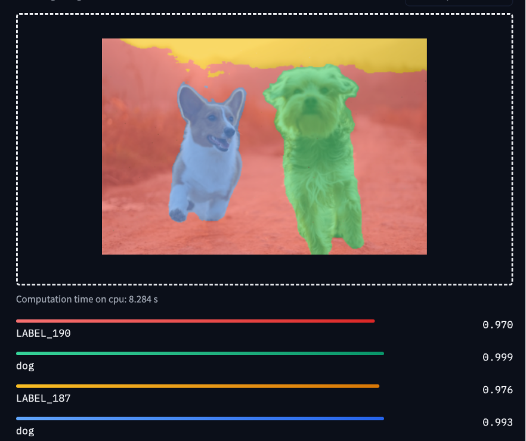
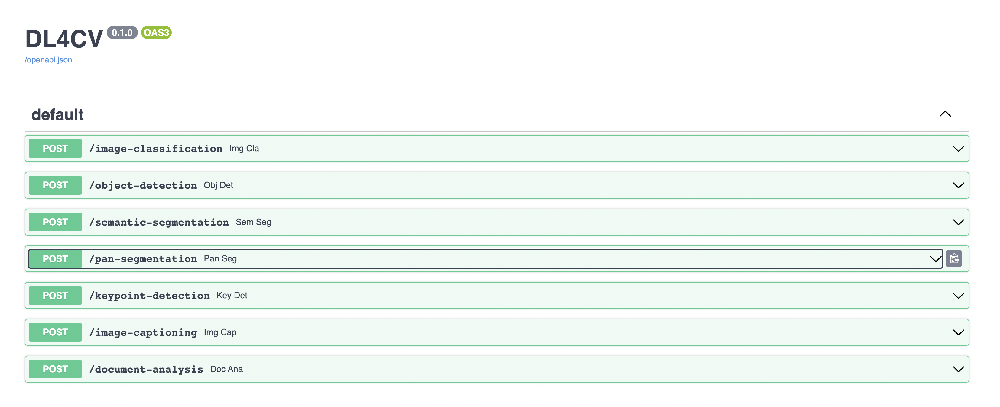

# dl4cv -  A Computer Vision Hugging Face Server Backend :rocket:

This is a projekt to integrate the major Computer Vision Use Cases into one Backend. The Deep Learning is working via the
Hugging Face Models.

This project was generated via [manage-fastapi](https://ycd.github.io/manage-fastapi/)! :tada:


  - [Showcases](#showcases)
  - [Installation with Docker](#installation-with-docker)
  - [Installation for Development](#installation-of-dependencies-for-development)
  - [Usage](#usage)


## Showcases

### Image Classification


### Image Segmentation


### Object Detection


### Panoptic Segmentation


### KeyPointDetection

### Image Captioning


## Installation with Docker

It's necessary to install Docker to start the Backend. You can download docker here: https://www.docker.com/
To start the backend if docker is installed
```docker-compose up --build -d```

After the Installation see chapter Usage to continue: [Usage](#usage)


## Installation of Dependencies for Development
Conda/Miniconda is recommended. This Project uses poetry for dependency management. To install poetry run:

```pip install poetry```

To install the dependencies run:

```poetry install```

To activate your poetry Venv run:

```poetry shell```

To start the API in dev Mode use:
```uvicorn main:app --reload```


##  Usage

To try the api immediatly you can access the openapi specification at:

```localhost:8000/docs```




## Included Libaries
- [Hugging Face] (https://github.com/huggingface/transformers)
